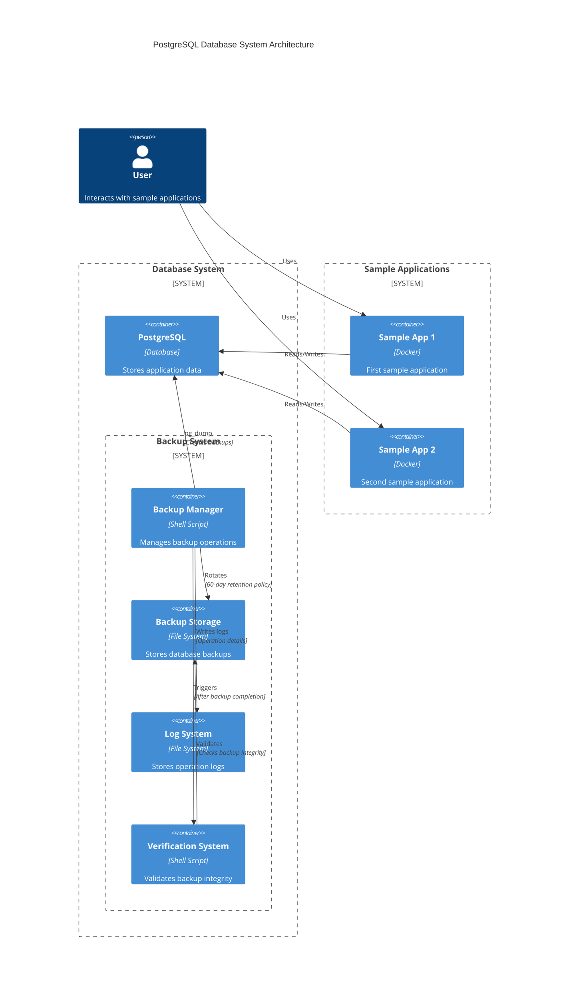

# System Architecture

## Overview
This document describes the architecture of the PostgreSQL database system and its backup infrastructure.

## Diagram

```mermaid
C4Context
    title PostgreSQL Database System Architecture

    Person(user, "User", "Interacts with sample applications")

    System_Boundary(db_system, "Database System") {
        Container(postgres, "PostgreSQL", "Database", "Stores application data")
        
        System_Boundary(backup_system, "Backup System") {
            Container(backup_manager, "Backup Manager", "Shell Script", "Manages backup operations")
            Container(backup_storage, "Backup Storage", "File System", "Stores database backups")
            Container(log_system, "Log System", "File System", "Stores operation logs")
            Container(verification, "Verification System", "Shell Script", "Validates backup integrity")
            
            Rel(backup_manager, postgres, "pg_dump", "Creates backups")
            Rel(backup_manager, backup_storage, "Stores backups", "Organized by database")
            Rel(backup_manager, log_system, "Writes logs", "Operation details")
            Rel(verification, backup_storage, "Validates", "Checks backup integrity")
            Rel(backup_manager, verification, "Triggers", "After backup completion")
            Rel(backup_manager, backup_storage, "Rotates", "60-day retention policy")
        }
    }

    System_Boundary(apps, "Sample Applications") {
        Container(app1, "Sample App 1", "Docker", "First sample application")
        Container(app2, "Sample App 2", "Docker", "Second sample application")
    }

    Rel(user, app1, "Uses")
    Rel(user, app2, "Uses")
    Rel(app1, postgres, "Reads/Writes")
    Rel(app2, postgres, "Reads/Writes")
```    